# Save the mouse

Save the mouse is a Python terminal game, that runs in the Code Institute mock terminal on Heroku.

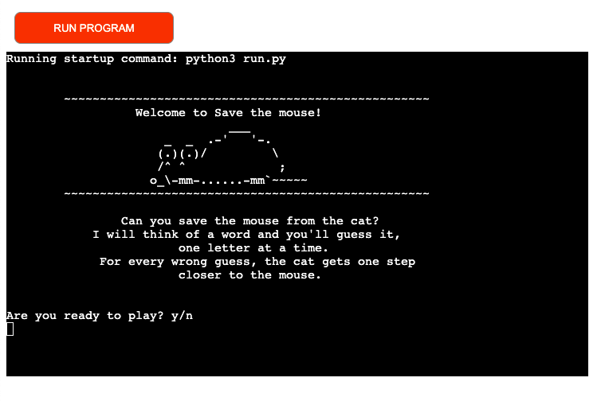

The game is a classic hangman game but with a cat chasing a mouse instead of a man being hanged. For every wrong guess, the cat gets one step closer to the mouse, if the player wins the mouse will survive, if the player instead loses the cat will be very happy.

## Who is the game for?

The game is for anybody who wants to play a hangman game.
The game displays a cat chasing a mouse rather than a man being hanged, so the game would also suit any cat-lovers out there.

## How to play

- The player is greeted and asked if they would like to start the game, if they enter y they will be asked to type in their player’s name.
- Once that is done, they will be given a short instruction on how to play the game and then asked if they want the computer to think of an easy or hard word.
- The computer thinks of a word and the gameboard is displayed, the player can see how many letters the word contains by counting underscores, which are displayed instead of the letters in the word.
- The player gets to make 7 guesses, if it’s correct the letter appears instead of the underscore, and they can make another guess at the next letter.
- If the guess is incorrectct the cat gets one step closer to the mouse and one guess will be drawn from the allowed 7.
- The game is finished once the word has been found or there are no more allowed guesses left

## User Experience

### User Goals

- The game must be easy to play.
- The player must be able to see which guesses already has been made
- The player must be able to see how many guesses are left
- The player should be able to choose the difficulty of the word

### User stories

#### First-time player perspective

- As a first-time player I want the game to be easy to play
- As a first-time player I want to see how many guesses I’ve got left
- As a first-time player, I want it to be easy to play again.

#### First-time player Fulfillment

- [x] Easily navigated, the game follows a flow of logic, and the player receives error messages if they type any wrong input

- [x] Number of guesses left is displayed every time the player enters a wrong guess
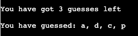

- [x] Once the game is finished the player is asked if they would like to play again
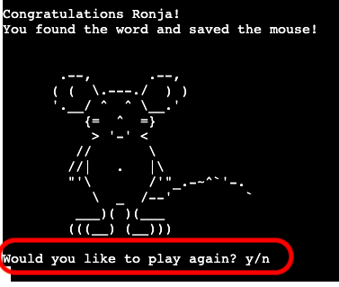

#### Returning player perspective

- As a returning player I want to be able to choose difficulties.
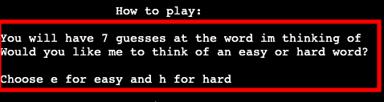

- As a returning player I want to be challenged by the game.

#### Returning player Fulfillment

- [x] The player can choose from easy or hard level after they have chosen their player name.
- [x] At the hard level the words are said to be the 40 most difficult words for hangman games, so the player should be challenged.

## Features

- The game consist of 9 functions

### Start of the game

- The game starts with greeting the player and giving them a short description of the game, then asking if the player is ready to play.

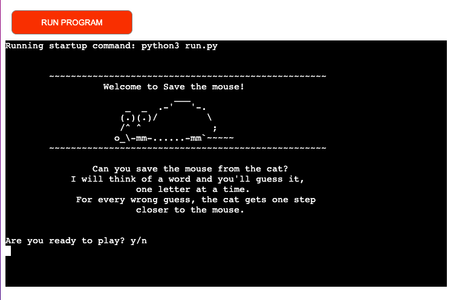

- The player will need to input ‘y’ for yes or ‘n’ for no, otherwise, an error message will appear, and they cannot continue until a valid input has been made.
- The input is checked with a function called checked_input, which also is used to validate the input for if the player would like to play again and when the player chooses the difficulty

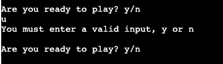

- If they input ‘n’ the game will shut down.

### Players 'game' name

- If the player enters y they will be asked to enter their player name, this is then capitalized using .capitalize(). Since it’s a game name they can enter anything that they’d like, but they cannot leave it blank.

### Invalid name input

- If the player doesn’t enter anything they will be asked one more time, if still nothing is being e
ntered the ‘computer’ will choose a random name from a name list and give it to the player. I thought it was a fun way to handle a blank input instead of just printing an error message to the terminal.
- I have used time.sleep to make it look like the computer is thinking of an name.

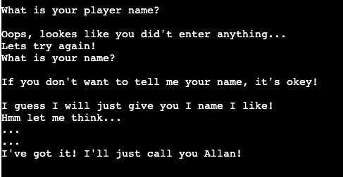

### Choosing difficulty

- Once the name part is done a short how-to-play message will appear and the player can now choose if they would like to guess an easy or difficult word.
- They will need to enter e for easy and h for hard, all other inputs will not be accepted, and the player will get a message telling them to enter a valid input.

### Generating a random word

- A word to be guessed will be randomly chosen using random.choice(), from a list of words, there are two lists, one for easy words and one for hard words.
- The list of the hard words is from a webpage that says it’s the 40 hardest words for a hangman game, so some of them are indeed quite difficult to guess, giving the player some challenge!

### Displaying the game

- Once the player has chosen the difficulty the game board will appear, and an underscore will be displayed for every letter in the word. The ‘computer’ also lets the player know how many letters the word contains.

### Guessing

- The player will be asked to enter their first guess, and they can only guess one letter at a time.

### Correct guesses

- If the player’s guess is correct the underscore will change to the right letter, making it a little bit easier for the next guess, also a happy mouse will appear and let the player know that their guess was correct.

### Incorrect guesses

- If on the other hand, the player’s guess was incorrect, the cat will move closer to the mouse and the player will be let aware that the guess was incorrect.

- The number of guesses left and what wrong letters have been guessed will also be displayed for the player to see.

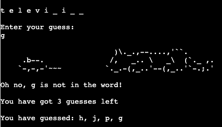

### Invalid guesses

- If the player would try to input anything other than a letter from the alphabet, they will be shown a message declaring that they need to enter a valid guess.

- They will also be alerted if they try to guess a letter that already has been guessed.

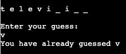

### Finished game

- The game is finished once the player either finds the secret word or when they run out of guesses.

- If the player wins a happy mouse will appear and congratulate the player for saving the mouse.

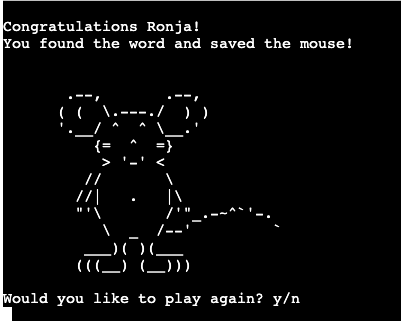

- If they lose a happy cat appears and the secret word will be displayed.

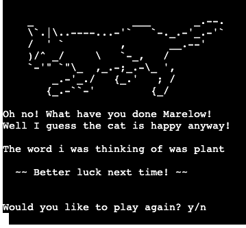

The player is then asked if they would like to play again, they can enter y or n, any other input will result in an error message asking the player to enter y if they would like to play again, any other input will quit the game.

### Features I would like to implement in the future

- A high score feature using google sheets.
- More words to guess from.
- Make the design of the game more appealing.
- A menu, now the game flows as intended, but with a high score feature, a proper menu would be a must.

## Testing

### Manual test

- I have tried to enter invalid inputs to the the game.

- I have had both friends and family test it with positive result

- It has been tested both on my local terminal and the Code institute Heroku terminal.

### Validator test

- PEP8 Online linter (Python validator)

The code passed without any errors.

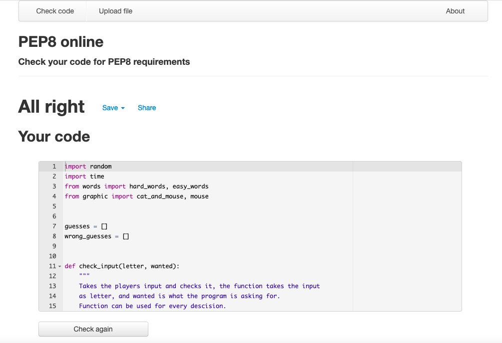

### Bugs

- One bug found was that the player could not leave the name input blank, but they could however enter more than one blank space and it would be accepted.
  - The solution was using .strip() to the name input and that solved the issue

## Deployment

The game was deployed to Heroku without any errors.
I used the Code Institute video to remind myself how to do it.

Since I only had imports that are in the standard Python library, I didn’t need to put them in the requirements.txt, so I went straight to it.

- Logged in to Heroku
- Created a new app
- Set the buildpacks to Python and NodeJS in that order
- Add config Vars KEY: PORT, VALUE: 8000
- Link the Heroku app to the repository on Github
- Choose the main branch and click on 'Deploy'
- I also enabled automatic deploys since I Deployed before the game was 100% finished for testing reasons.

### Layout issues

- The first ASCII image for 'game over' looked really good on my local terminal, after deploying the game on Heroku only the lower half of the cat was visible.
  - I resolved it by changing it to another cat.

This was the first design, looked good on my local terminal, but not once deployed to Heroku.

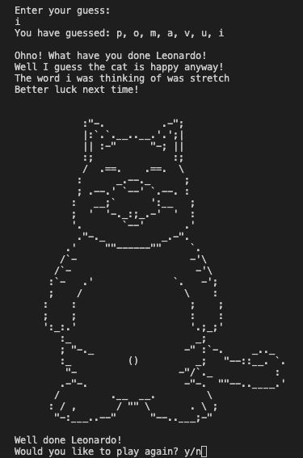
